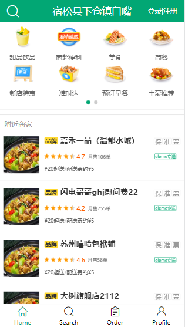
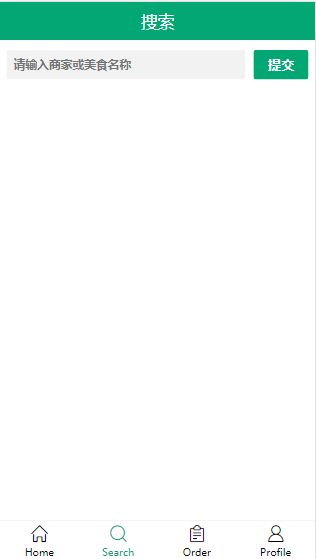
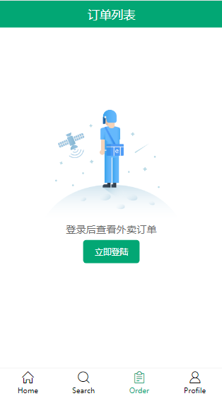
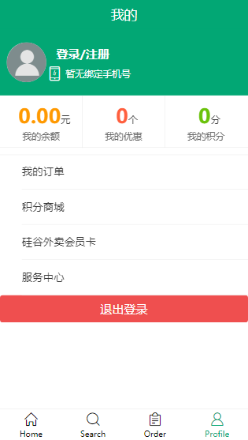
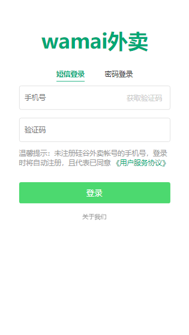
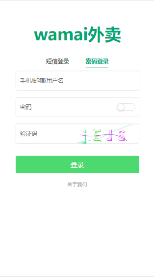
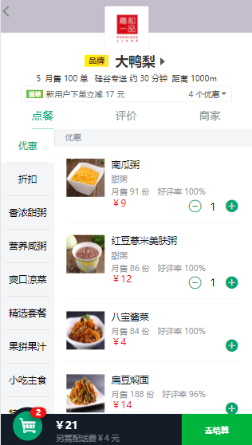
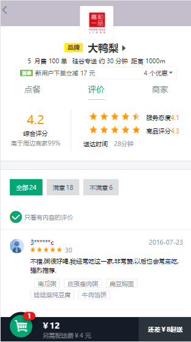

# 简介

### 一、项目介绍

**1.描述**

​        此项目为一个前后端分离的外卖 Web App (SPA) 项目，包括商家, 商品, 购物车, 用户等多个功能子模块，使用Vue前端MVVM框架开发，采用模块化、组件化、工程化的模式开发。

**2.技术栈**

Vue2、Vue-router、Vuex、Vue-Cli4、Mint-UI、axios、mockjs、better-scroll等

**3.实现功能**

* 首页（轮播图、商家列表）
* 搜索页面
* 订单页面
* 用户中心
* 商家页面
  * 购物车
  * 商品列表（左右联动滚动）
  * 评论页面
  * 商家信息页面

* 登录注册页面（手机验证码登录、用户名密码登录）

### 二、项目截图

### 三、项目运行

**1.server文件夹**

* npm install
* npm run start

注：启动后台应用前需先打开mongoDB数据库

**2.client文件夹**

* npm install
* npm run serve